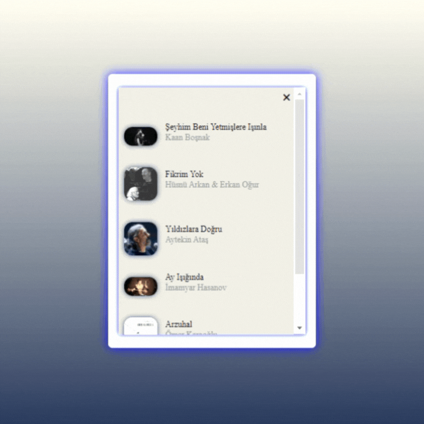

<h1>Mp3Player</h1>

This project is an mp3 page. In this project, functions such as listing various songs, playing in order, shuffle play, advance, stop are created using javaScript. page design is created using html, css.

<h2>Used Tech.</h2>
-HTML
-CSS
-JavaScript

<h3>Project Gif</h3>

